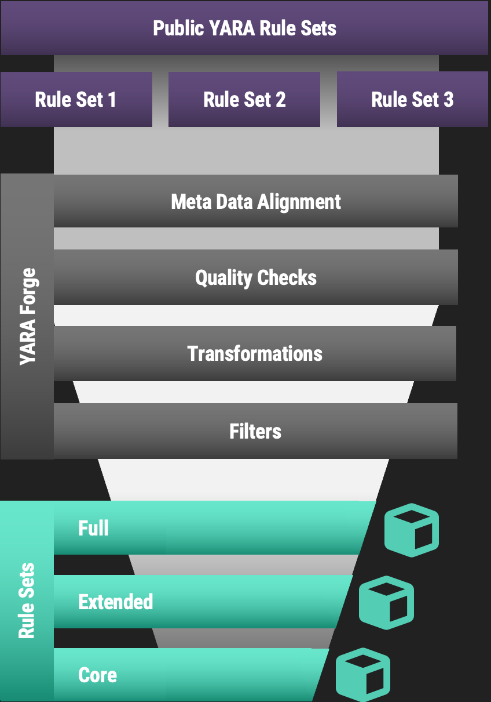
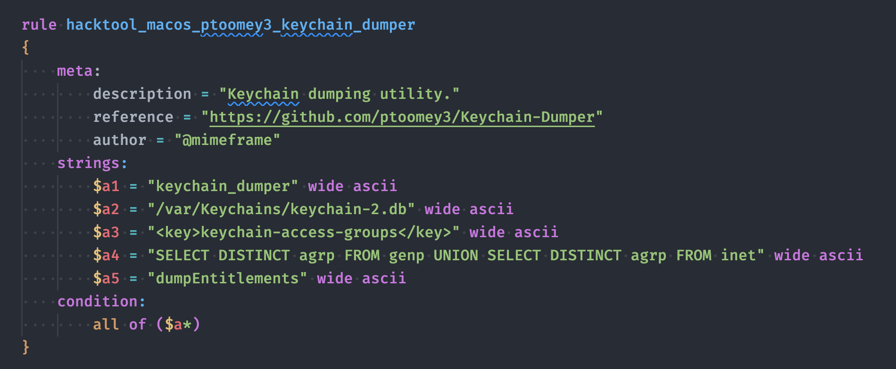
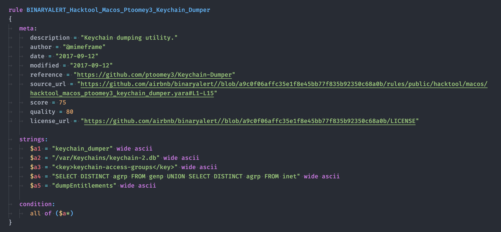
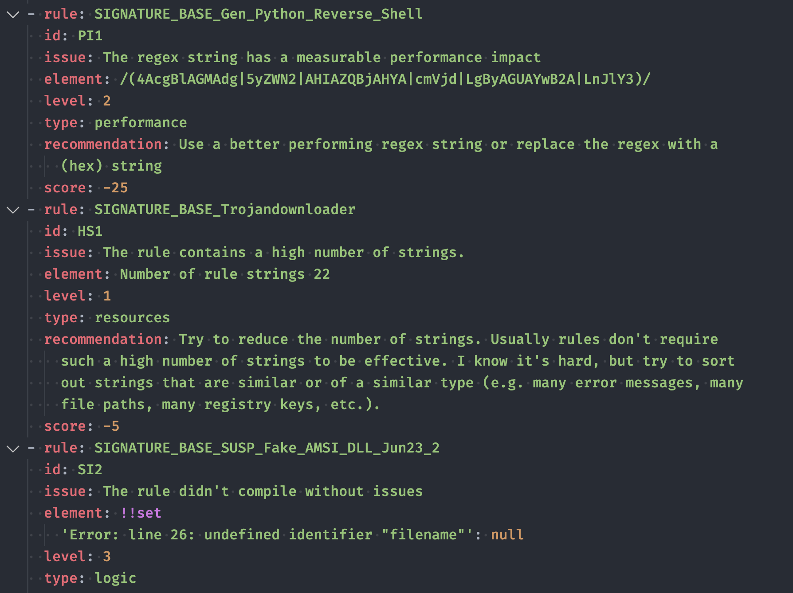
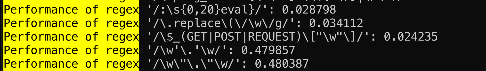
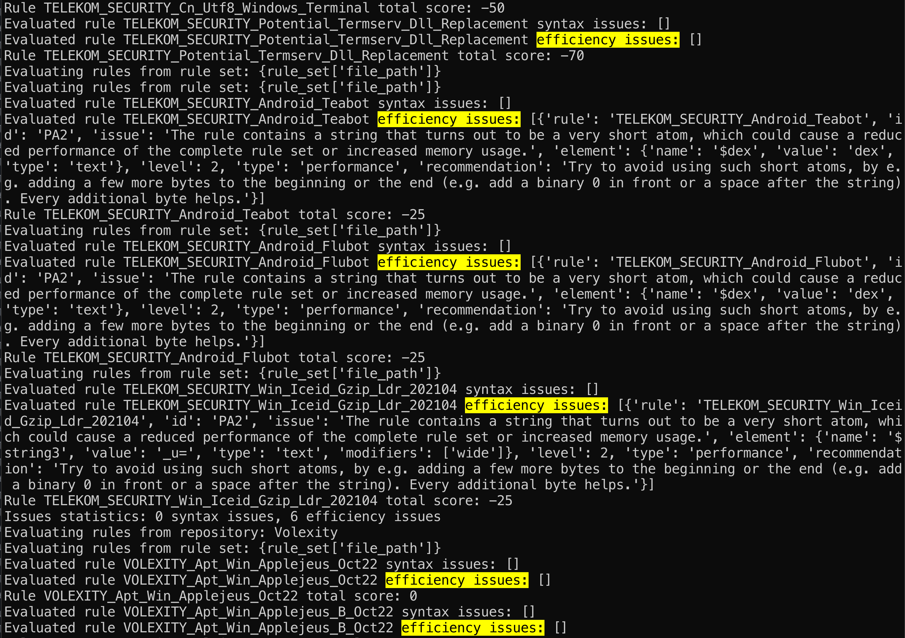

YARA Forge specializes in delivering high-quality YARA rule packages for immediate integration into security platforms. This tool automates the sourcing, standardization, and optimization of YARA rules from a variety of public repositories shared by different organizations and individuals. By collating these community-contributed rules, YARA Forge ensures that each package meets rigorous quality standards, offering a diverse and comprehensive rule set.

The output is a set of reliable, performance-oriented YARA rules, curated from these public repositories and made ready for use by analysts and security teams. With YARA Forge, you get a straightforward solution to employing consistent and effective YARA rules from a broad community base without the hassle.

## Rule Sets

Choose the YARA rule set that meets your requirements:

- **Core Set**: Contains only rules with high accuracy and low false positive rates, optimized for performance. Ideal for critical environments where stability is key.
- **Extended Set**: Expands the Core Set with additional threat hunting rules for a wider coverage, accepting minimal increases in false positives and scan impact. Suitable for balanced security needs.
- **Full Set**: Incorporates all functional rules, prioritizing breadth of threat detection. Best for scenarios where extensive coverage outweighs the cost of higher false positives and resource use.

### Recommended Use Cases

This section provides details on each rule set and their intended use in a technical environment.

#### Core

The "Core" rule set excludes rules with a high propensity for false positives and those that significantly affect system performance. It filters out low "score" rules, often used for threat hunting, and low "quality" rules that may slow down scans. This set prioritizes stability and accuracy.

Use the "Core" rule set if you need to:

- Minimize false positives
- Ensure rules are performance-optimized
- Employ a concise set of highly accurate rules

#### Extended

The "Extended" rule set builds upon the "Core" by adding effective threat hunting rules that might slightly increase false positives and affect scan performance. It excludes rules that are experimental or have very low quality scores.

The "Extended" rule set is ideal for those who:

- Want a balance between detection capability and performance
- Prefer broader coverage with a controlled increase in false positives

#### Full

The "Full" rule set includes all operational rules from the repositories, except for those that are non-functional or have a severe impact on performance. It comprises threat hunting rules and expects a higher volume of false positives.

Choose the "Full" rule set if you:

- Aim for the broadest threat coverage available
- Have a system in place to manage false positives effectively
- Are less concerned about the impact on system resources and scanning speed

## Overview



### More Detailed Description

#### Collection

In the collection phase, YARA rules are retrieved by cloning their respective GitHub repositories. This approach is chosen over downloading ZIP files to obtain commit history, which provides additional data on rule creation and modification times if such timestamps are not present in the rule metadata. The repositories are cloned into the ./repos directory, with each repository stored in a separate subdirectory. License information for each rule is also extracted at this stage and recorded for subsequent use. The collected rules are parsed, and metadata is structured, capturing details such as retrieval time, latest commit hash, repository owner, and branch.

#### Processing

During processing, rules are conformed to a standardized format defined in the project's [YARA Style Guide](https://github.com/Neo23x0/YARA-Style-Guide/). This includes ensuring that all required metadata fields are present and uniformly named across the dataset. For example, various terms like "information," "details," and "desc" are consolidated under a single "description" field. This normalization facilitates compatibility with different security products that consume these rules. Duplicate detection goes beyond name comparison, extending to the logical structure of the rules to ensure only unique rules are retained. Private rules are renamed and all corresponding references are updated accordingly to maintain consistency.

#### Quality Checks

Quality assessment is conducted by assigning different scores to each rule based on several characteristics (quality, importance, severity), with the aim of quantifying rule relevance for the different output packages. The base quality score from the YARA Forge configuration file is adjusted according to any detected issues with a rule. Rule evaluation is performed using YARA for detecting syntax errors and performance warnings, and yaraQA for identifying less apparent logic and performance issues. yaraQA checks include evaluations of string duplication, atom length, module calculation costs, and regular expression performance. Issues identified result in deductions from the rule's quality score, as defined in the configuration file. Manual quality deductions are also applied for rules known to generate false positives in goodware databases.

#### Output

The output phase involves the creation of rule packages. Three distinct rule sets are defined: Core, Extended, and Full, each with its own filtering criteria as specified in the configuration file. Packages are assembled with a header section that includes metadata and license information. These are then saved in the ./packages directory within their own subdirectories. A final verification step is performed using YARA to confirm there are no errors in the compiled rule sets.

## Build Log

The --debug flag enables verbose logging, providing detailed information on the rule retrieval process, quality checks, and filter application. This facilitates debugging and offers transparency into the rule selection and packaging process.

The log file of the latest build can be viewed [here](https://github.com/YARAHQ/yara-forge/releases/latest/download/yara-forge-log.txt)

The discovered quality / performance / resource usage issues can be found [here](https://github.com/YARAHQ/yara-forge/releases/latest/download/yara-forge-rule-issues.yml)

## Examples

### Rule Example

Before:



After:



### Rule Issues

The file `yara-forge-rule-issues.yml` contains all identified issues with the collected rules. It gets uploaded as an attachment to each rule set release.



### Regular Expression Performance Measurements




### yaraQA Performance Issue Evaluations



### Rule Set Header Example

```text
/*
 * YARA-Forge YARA Rule Package
 * https://github.com/YARAHQ/yara-forge
 * 
 * Rule Package Information
 * Name: core 
 * Description: Default YARA Rule Package - Core
 * YARA-Forge Version: 0.6.0
 * YARA-QA Commit: 6d0cfc3b5356c3a58f79d98077ad505e4493785c
 * Minimum Quality: 70
 * Force Include Importance Level: 80
 * Force Exclude Importance Level: 50
 * Minimum Age (in days): 1
 * Minimum Score: 65
 * Creation Date: 2023-12-04
 * Number of Rules: 7164
 * Skipped: 0 (age), 583 (quality), 663 (score), 1195 (importance)
 */
```

### Rule Set Section Header Example

```text
/*
 * YARA Rule Set
 * Repository Name: Elastic
 * Repository: https://github.com/elastic/protections-artifacts/
 * Retrieval Date: 2023-12-04
 * Git Commit: cb45629514acefc68a9d08111b3a76bc90e52238
 * Number of Rules: 1331
 * Skipped: 0 (age), 69 (quality), 0 (score), 0 (importance)
 *
 * 
 * LICENSE
 * 
 * Elastic License 2.0

URL: https://www.elastic.co/licensing/elastic-license

## Acceptance
...
```

## YARA Forge Program Code

You can find the YARA Forge program code [here](https://github.com/YARAHQ/yara-forge).

## Next Steps

- Automatic transformations: I'd like to automatically transform rules to improve them, e.g. rewrite a `$mz = { 4d 5a }` as `uint16(0) == 0x5a4d`
- Automated goodware tests: currently I still test the rules manually and add negative scores in the `custom-score-reductions.yml` file for rules that have shown to produce false positives on our internal goodware set. In order to test them live in the github workflows, the script would need access to an [Mquery](https://github.com/CERT-Polska/mquery) or [Klara](https://github.com/KasperskyLab/klara) instance from within the workflows to evaluate the number of false positives matches while it's running. I still don't know how to approach that challenge. Please contact me if you have an idea how to do this.

## Credits

I want to express my sincere appreciation to all the repository owners and rule authors who have indirectly contributed to YARA Forge. Your commitment to cybersecurity and the high quality of your work have allowed me to offer a solution that effectively reformats, filters, and repackages your rules into more functional and accessible packages.

Below is the list of repositories included in the initial release of YARA Forge:

Status as of 2021-12-04

- [ReversingLabs](https://github.com/reversinglabs/reversinglabs-yara-rules/)
- [Elastic](https://github.com/elastic/protections-artifacts/)
- [R3c0nst](https://github.com/fboldewin/YARA-rules/)
- [CAPE](https://github.com/kevoreilly/CAPEv2)
- [BinaryAlert](https://github.com/airbnb/binaryalert/)
- [DeadBits](https://github.com/deadbits/yara-rules/)
- [DelivrTo](https://github.com/delivr-to/detections)
- [ESET](https://github.com/eset/malware-ioc)
- [FireEye-RT](https://github.com/mandiant/red_team_tool_countermeasures/)
- [GCTI](https://github.com/chronicle/GCTI)
- [Malpedia](https://github.com/malpedia/signator-rules/)
- [McAfee ATR](https://github.com/advanced-threat-research/Yara-Rules/)
- [Arkbird SOLG](https://github.com/StrangerealIntel/DailyIOC)
- [Telekom Security](https://github.com/telekom-security/malware_analysis/)
- [Volexity](https://github.com/volexity/threat-intel)
- [JPCERTCC](https://github.com/JPCERTCC/MalConfScan/)
- [Signature Base](https://github.com/Neo23x0/signature-base)

For a full list of all currently integrated YARA rule repositories, review the config file [here](https://github.com/YARAHQ/yara-forge/blob/master/yara-forge-config.yml).

Author of YARA Forge: [Florian Roth](https://x.com/cyb3rops)
